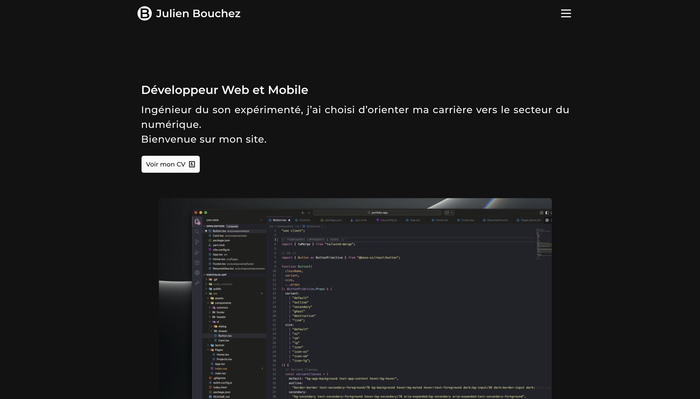

# 🌐 Site personnel | Portfolio 🌐

---

## 📌 Description

Voici mon site personnel que je vous invite à consulter à l'adresse suivante : .

---

## 🏗️ Technologies utilisées

- **React** — Framework principal.
- **React Router** — Framework React pour le routing multipage.
- **TypeScript** — Pour un code mieux défini et une meilleur expérience développeur.
- **Responsive Design** — Site conçu selon la méthode "Mobile First" et entièrement **_responsive_**.

---

## 📚 Librairies utilisées

- **Tailwind CSS** — Librairie servant à concevoir l'interface utilisateur du site.
- **ShadCN UI** — Librairie de composants UI préconfigurés pour Tailwind CSS.
- **BaseUI** — Librairie de composants primaires.

---

## 📄 License

Ce projet est personnel. Il n’est pas destiné à un usage commercial.

---

## 📡 Contact

- Julien Bouchez : julienbouchez@icloud.com
- Profile GitHub : [@JulienBouchez](https://github.com/julienb84)
- Profile LinkedIn : [@JulienBouchez](https://www.linkedin.com/in/julien-bouchez-developer/)
